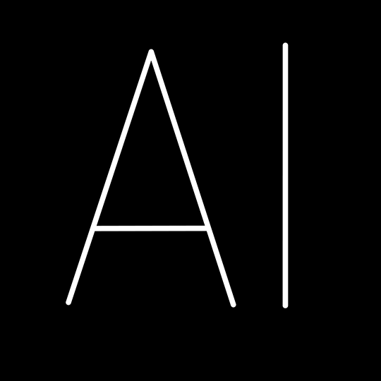

### Hey there! I am Soham Naik. 👋
Results-driven AI Engineer and aspiring Data Scientist with a strong foundation in machine learning, NLP, and data engineering. Currently pursuing a Master's in Information Management at the University of Washington while working at Castor EDC developing HIPAA-compliant AI solutions that have reduced data entry costs by 50%.

At Johnson & Johnson, I'm analyzing histopathology image data through ETL processes and statistical analysis, creating visualizations in Tableau that drive actionable insights for stakeholders. My research at UW's NLP Lab evaluated bias in LLM models and implemented zero-shot retrieval frameworks analyzing 10,000+ documents.

With published research in both NLP and Computer Vision, I bridge theoretical knowledge with practical applications. I specialize in building efficient data pipelines, RAG systems, and ML models that solve real business problems, having previously delivered a SARIMA forecasting model that improved sales prediction accuracy by 20% at Metro AG.

Looking to leverage my technical expertise in Python, SQL, Azure, and TensorFlow to drive innovation in data science, AI engineering, or data analyst roles.

 I am motivated by the potential of data and technology to improve lives and create positive impact.

</img>

&nbsp;
&nbsp;

<h3>Languages and Tools:</h3>

 
 
   

 
 

<!--
**soham0701/soham0701** is a ✨ _special_ ✨ repository because its `README.md` (this file) appears on your GitHub profile.

Here are some ideas to get you started:

- 🔭 I’m currently working on ...
- 🌱 I’m currently learning ...
- 👯 I’m looking to collaborate on ...
- 🤔 I’m looking for help with ...
- 💬 Ask me about ...
- 📫 How to reach me: ...
- 😄 Pronouns: ...
- ⚡ Fun fact: ...
-->
